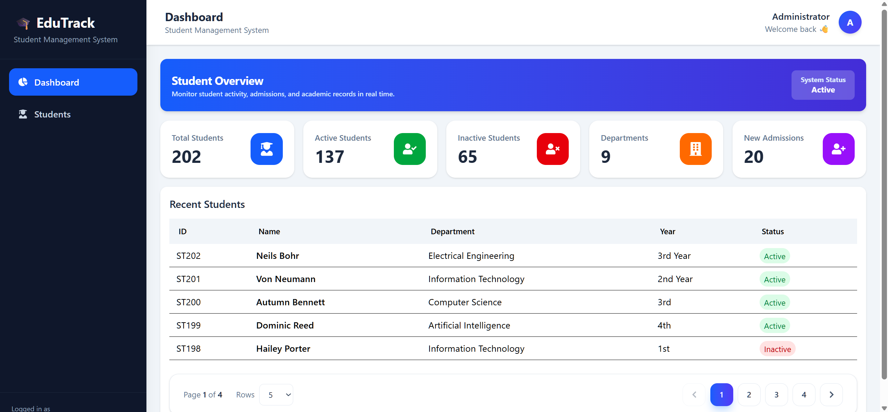
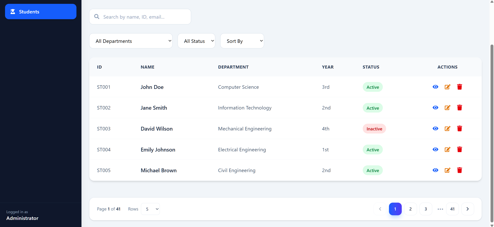
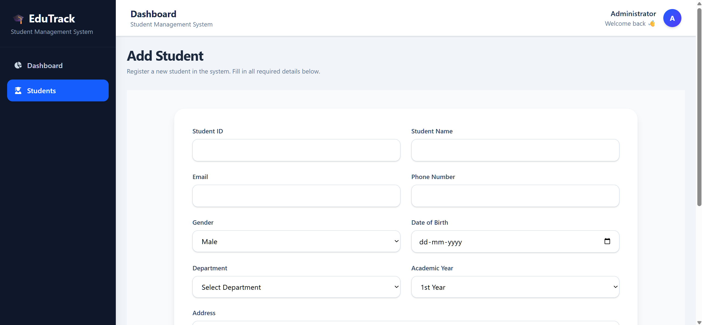
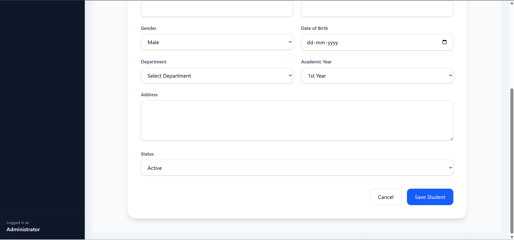
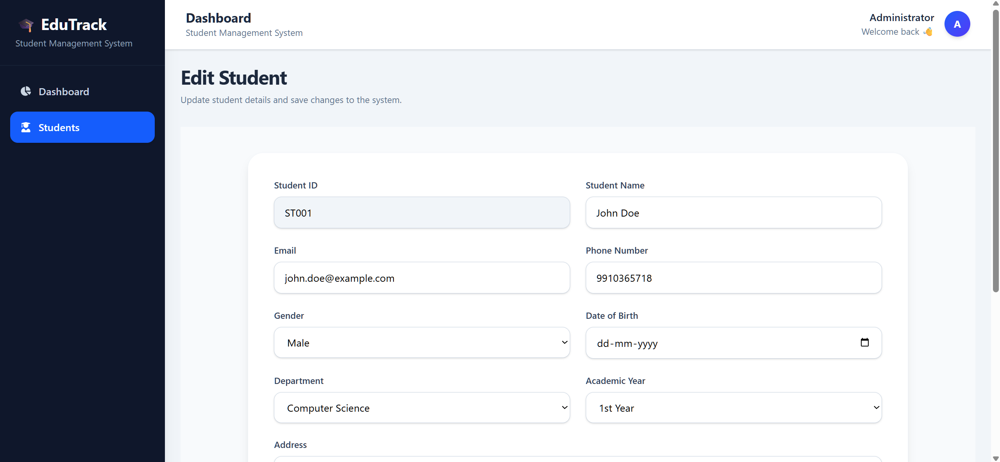
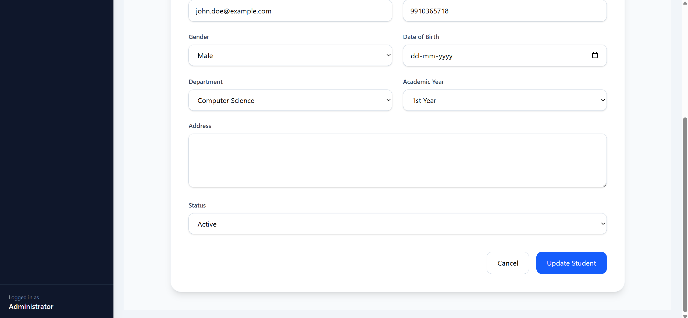

# 🎓 Student Management System (POC)

A modern full-stack **Student Management System** built with **React**, **Node.js**, **Express**, and **JSON file storage**. This proof of concept (POC) demonstrates a responsive dashboard for managing student records with real-time updates, analytics, and complete CRUD functionality.

---

## ✨ Features

* 📊 Interactive dashboard with student statistics
* 👨‍🎓 Create new student records
* ✏️ Update existing student information
* ❌ Delete student records
* 🔍 Search students by name or ID
* 🎯 Filter by department and enrollment status
* ↕️ Sort student records
* 📄 View detailed student profiles
* ⚡ Instant UI updates after every action
* 💾 Lightweight JSON-based file storage (no database required)

---

## 🛠️ Tech Stack

### Frontend

* React
* React Router DOM
* Tailwind CSS
* Axios
* React Icons
* Vite

### Backend

* Node.js
* Express.js
* File System (`fs`)
* JSON-based storage

---

## 📸 Screenshots

### Dashboard



### Students List



### Add Student

<p align="center">
  
  
</p>

### Edit Student

<p align="center">
  
  
</p>

---

## 🚀 Getting Started

### 1. Clone the Repository

```bash
git clone https://github.com/your-username/student-management-system.git
cd student-management-system
```

### 2. Install Backend Dependencies

```bash
npm install
```

### 3. Start the Backend Server

```bash
node server.js
```

The backend will be available at:

```text
http://localhost:5000
```

### 4. Install Frontend Dependencies

```bash
cd frontend
npm install
```

### 5. Start the Frontend Development Server

```bash
npm run dev
```

The frontend will be available at:

```text
http://localhost:5173
```

---

## 📂 Project Structure

```text
student-management-system/
│
├── frontend/          # React application
├── data/              # JSON storage
├── server.js          # Express server
├── screenshots/       # README images
├── package.json
└── README.md
```

---

## 📌 Notes

* This project uses **JSON file storage** instead of a traditional database, making it ideal for demos, prototypes, and learning purposes.
* All CRUD operations are persisted in the JSON file.
* Designed with a responsive interface using Tailwind CSS.

---

## 📄 License

This project is intended for educational and demonstration purposes.
