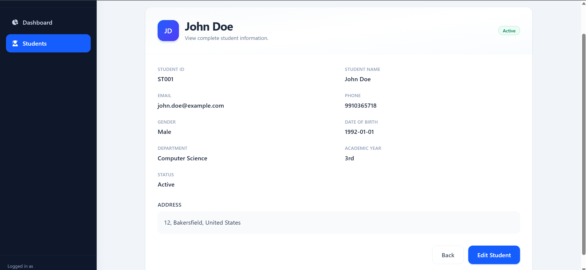

# 🎓 Student Management System (POC)

A modern full-stack **Student Management System** built with **React**, **Node.js**, **Express**, and **JSON file storage**. This proof of concept (POC) demonstrates a responsive dashboard for managing student records with real-time updates, analytics, and complete CRUD functionality.

---

## ✨ Features

* 📊 Interactive dashboard with student statistics
* 👨‍🎓 Create new student records
* ✏️ Update existing student information
* ❌ Delete student records
* 🔍 Search students by name or ID
* 🎯 Filter by department and enrollment status
* ↕️ Sort student records
* 📄 View detailed student profiles
* ⚡ Instant UI updates after every action
* 💾 Lightweight JSON-based file storage (no database required)

---

## 🛠️ Tech Stack

### Frontend

* React
* React Router DOM
* Tailwind CSS
* Axios
* React Icons
* Vite

### Backend

* Node.js
* Express.js
* File System (`fs`)
* JSON-based storage

---

## 📸 Screenshots

### Dashboard


### Students List


### View Student


### Add Student

<p align="center">
  
  
</p>

### Edit Student

<p align="center">
  
  
</p>

---

## 🚀 Getting Started

### 1. Clone the Repository

```bash
git clone https://github.com/your-username/student-management-system.git
cd student-management-system
```

### 2. Install Backend Dependencies

```bash
npm install
```

### 3. Start the Backend Server

```bash
npm run server
```

The backend will be available at:

```text
http://localhost:5000
```

### 4. Install Frontend Dependencies

```bash
cd frontend
npm install
```

### 5. Start the Frontend Development Server

```bash
npm run dev
```

The frontend will be available at:

```text
http://localhost:5173
```

---

## 📂 Project Structure

```text
student-management-system/
├── README.md
├── backend
│   ├── controllers
│   │   ├── departmentController.js
│   │   └── studentController.js
│   ├── data
│   │   ├── departments.json
│   │   └── students.json
│   ├── routes
│   │   ├── departmentRoutes.js
│   │   └── studentRoutes.js
│   └── server.js
├── frontend
│   ├── README.md
│   ├── eslint.config.js
│   ├── index.html
│   ├── package-lock.json
│   ├── package.json
│   ├── public
│   │   ├── favicon.svg
│   │   └── icons.svg
│   ├── src
│   │   ├── App.jsx
│   │   ├── assets
│   │   │   ├── hero.png
│   │   │   ├── react.svg
│   │   │   └── vite.svg
│   │   ├── components
│   │   │   ├── dashboard
│   │   │   │   ├── RecentStudents.jsx
│   │   │   │   └── StatCard.jsx
│   │   │   ├── layout
│   │   │   │   ├── DashboardLayout.jsx
│   │   │   │   ├── Navbar.jsx
│   │   │   │   └── Sidebar.jsx
│   │   │   └── students
│   │   │       ├── DeleteModal.jsx
│   │   │       ├── FilterBar.jsx
│   │   │       ├── Pagination.jsx
│   │   │       ├── SearchBar.jsx
│   │   │       ├── StudentForm.jsx
│   │   │       └── StudentTable.jsx
│   │   ├── index.css
│   │   ├── main.jsx
│   │   ├── pages
│   │   │   ├── AddStudent.jsx
│   │   │   ├── Dashboard.jsx
│   │   │   ├── EditStudent.jsx
│   │   │   ├── StudentDetails.jsx
│   │   │   └── Students.jsx
│   │   └── services
│   │       └── studentService.js
│   └── vite.config.js
├── package-lock.json
├── package.json
└── screenshots
    ├── add-student.png
    ├── add-student2.png
    ├── dashboard.png
    ├── edit-student.png
    ├── edit-student2.png
    ├── students.png
    └── view-student.png
```

---

## 📌 Notes

* This project uses **JSON file storage** instead of a traditional database, making it ideal for demos, prototypes, and learning purposes.
* All CRUD operations are persisted in the JSON file.
* Designed with a responsive interface using Tailwind CSS.

---

## 📄 License

This project is intended for educational and demonstration purposes.
